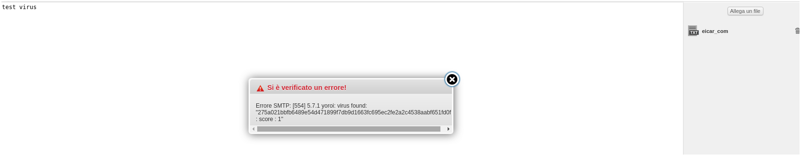

# INTRO

YOMI RSPAMD it's a lua plugin that, in combination with <a href="https://github.com/nethesis/yomi-proxy">yomi-proxy</a>, permit to analize every mail attachment sent from rspamd to <a href="https://yoroi.company">yoroi sandbox (YOMI)</a>.
Before install this package, you has to install <a href="https://github.com/nethesis/yomi-proxy">yomi-proxy</a>.

# PREREQUISITE

- rspamd

# INSTALLATION

Clone this repository on your local server:
```
git clone https://github.com/nethesis/yomi-rspamd
```

Copy yomi.lua file on directory :

```
cp yomi.lua /usr/share/rspamd/lualib/lua_scanners/
```

Add the below line inside  `/usr/share/rspamd/lualib/lua_scanners/init.lua` under the `---Antiviruses` section:
```
require_scanner('yomi')
```

# CONFIGURE

YOMI RSPAMD has basic configuration setup.

Fist, edit the antivirus.conf located on :

```
mkdir -p /etc/e-smith/templates-custom/etc/rspamd/local.d/antivirus.conf/
cat << EOF > /etc/e-smith/templates-custom/etc/rspamd/local.d/antivirus.conf/21yomi
yomi \{
  action = "reject";
  message = '\$SCANNER: virus found: "\$VIRUS"';
  scan_mime_parts = true;
  max_size = 20000000;
  symbol = "YOMI_VIRUS";
  type = "yomi";
  log_clean = true;
  url = "https://yomi.nethserver.net/yomi"
\}
EOF

expand-template /etc/rspamd/local.d/antivirus.conf
systemctl restart rspamd
```

# Test 

Send an email and check if the attachment its a malware.



Tested with EICAR-TEST


